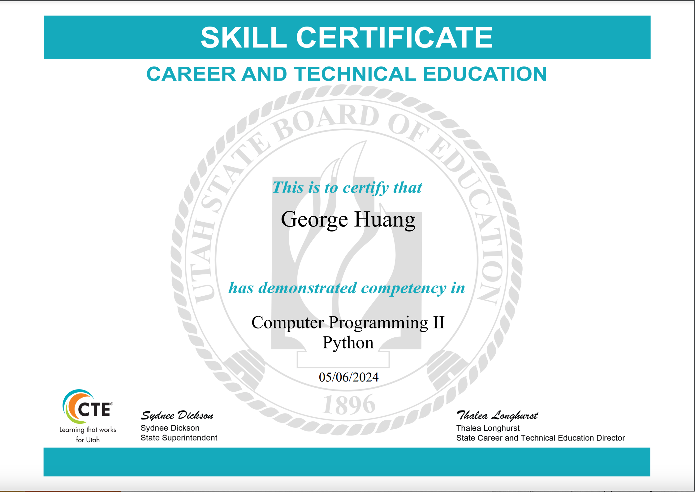
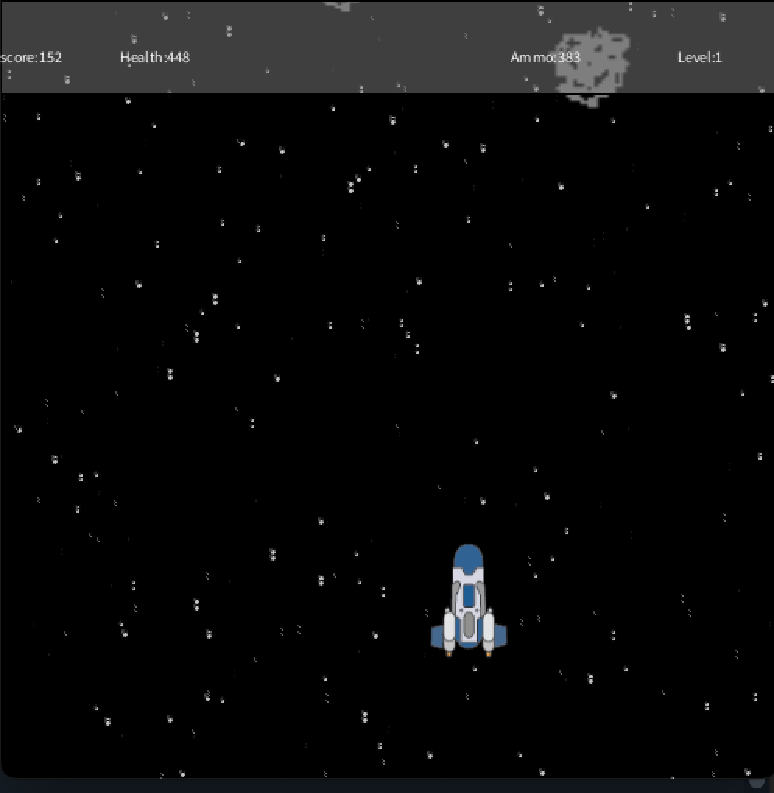
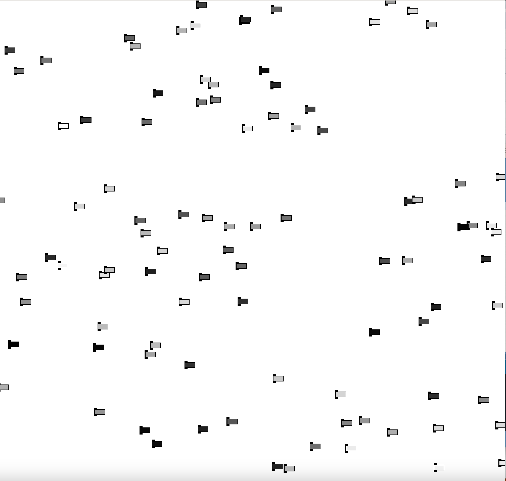
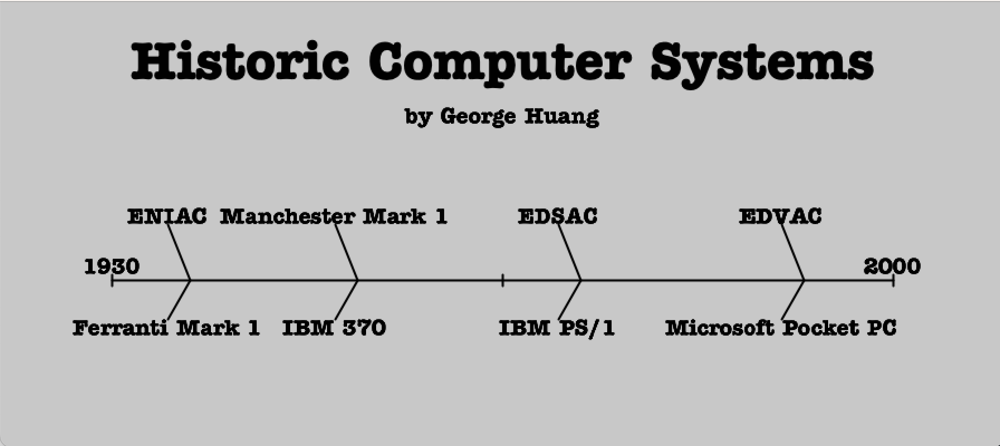
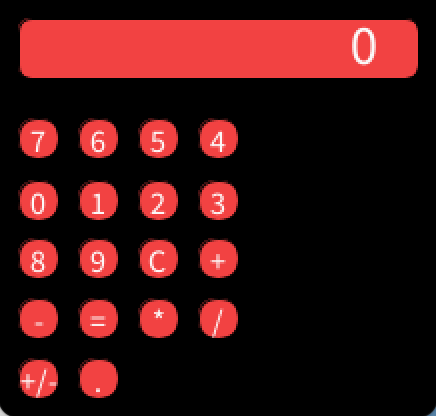
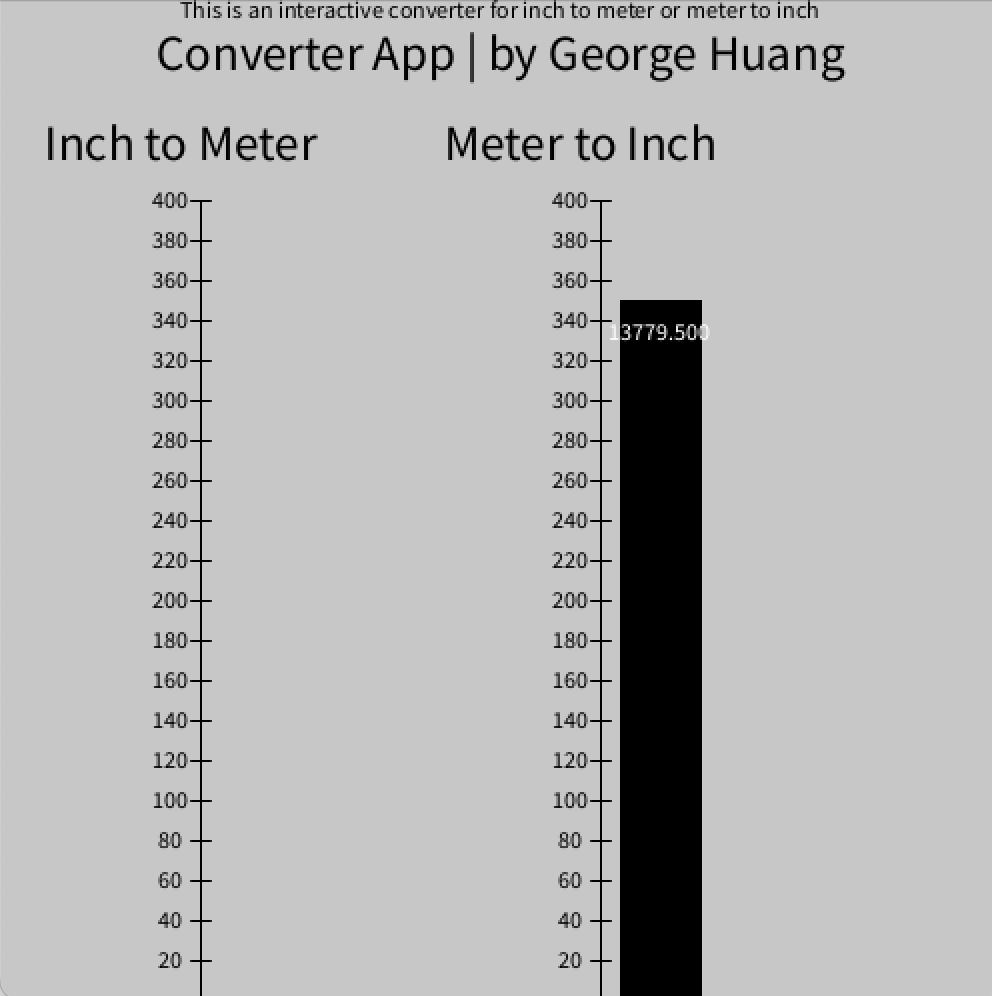

# George Huang's Programming Portfolio 2024
Contact info: g89312@hotmail.com
## Tech Certifications

## Group Project

## Individual Projects

### SpaceGame
OOP graphical game using sound and images for a full user experience

[Source Code](https://github.com/S-erenity/programmingportfolio/blob/main/src/SpaceGame.zip)

### Cars
A car simulator

[Source Code](https://github.com/S-erenity/programmingportfolio/blob/main/src/DriveCars.zip)

### Timeline
Interactive Timeline of Computers

[Source Code](https://github.com/S-erenity/programmingportfolio/blob/main/src/Timelinedone.zip)

### Calculator
A calculator simulator

[Source Code](https://github.com/S-erenity/programmingportfolio/blob/main/src/Calculator.zip)

### Conversion App
Converts Inches to Meters and Meters to Inch

[Source Code](https://github.com/S-erenity/programmingportfolio/blob/main/src/ConversionApp2.zip)

