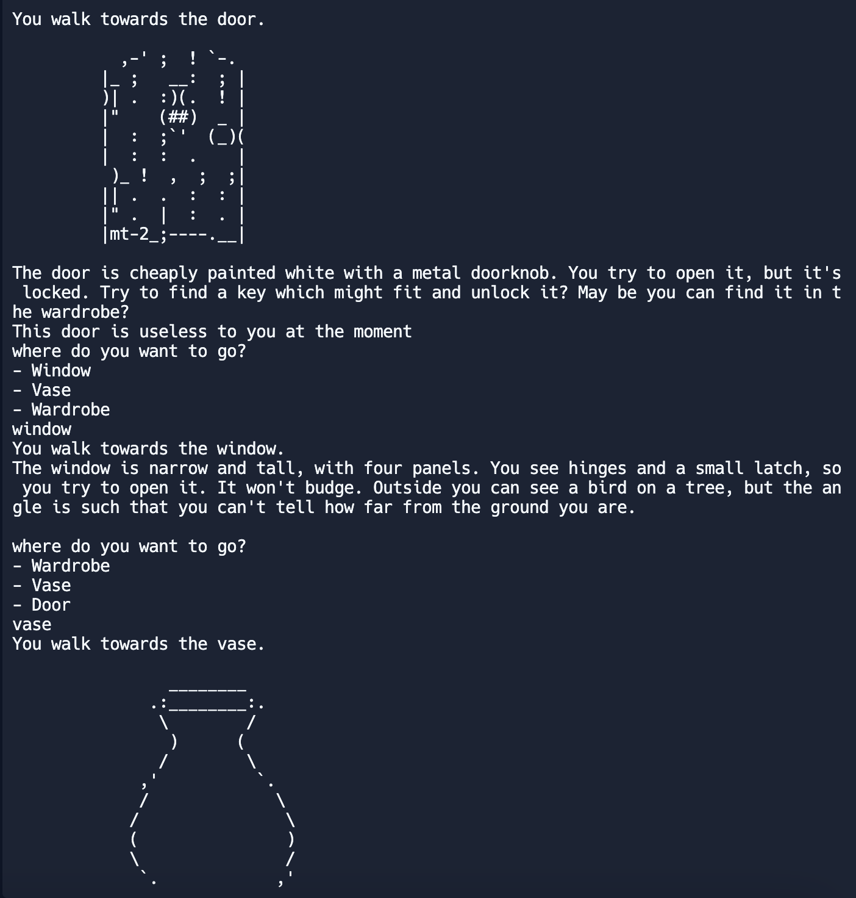

# George Huang's Programming Portfolio 2024
Contact info: g89312@hotmail.com
## Tech Certifications

## Group Project
Empty Rooms:
Alone in a locked room, the user must investigate objects and answer existential questions to escape. The game includes a number of different challenging problems thats makes the user use problem-solving skills to try to escape. The game includes a number of different objects for the user to interact with creating a more immersive experience.
https://github.com/Rahul7834/Empty-Rooms

## Individual Projects
KLIX: Welcome to KLIX, the ultimate clicker game where every tap counts! In KLIX, your goal is simple: click the circle as many times as possible to rack up points and unlock powerful upgrades. The more clicks you unleash, the faster you progress through the game.

But be warned, the challenge doesn't end with clicking alone. Along the way, you'll encounter various upgrades that enhance your clicking power, allowing you to earn points even faster. As you continue to click your way through the game, you'll unlock badges that showcase your achievements and progress. Eventually, Your power will rival those of gods, allowing you to transend reality and gain control the klix universe. https://github.com/S-erenity/KLIX

Are you ready to embark on a clicking adventure like no other? Get your fingers ready and dive into the addictive world of KLIX!
### SpaceGame
OOP graphical game using sound and images for a full user experience

[Source Code](https://github.com/S-erenity/programmingportfolio/blob/main/src/SpaceGame.zip)

### Cars
A car simulator

[Source Code](https://github.com/S-erenity/programmingportfolio/blob/main/src/DriveCars.zip)

### Timeline
Interactive Timeline of Computers

[Source Code](https://github.com/S-erenity/programmingportfolio/blob/main/src/Timelinedone.zip)

### Calculator
A calculator simulator

[Source Code](https://github.com/S-erenity/programmingportfolio/blob/main/src/Calculator.zip)

### Conversion App
Converts Inches to Meters and Meters to Inch

[Source Code](https://github.com/S-erenity/programmingportfolio/blob/main/src/ConversionApp2.zip)

