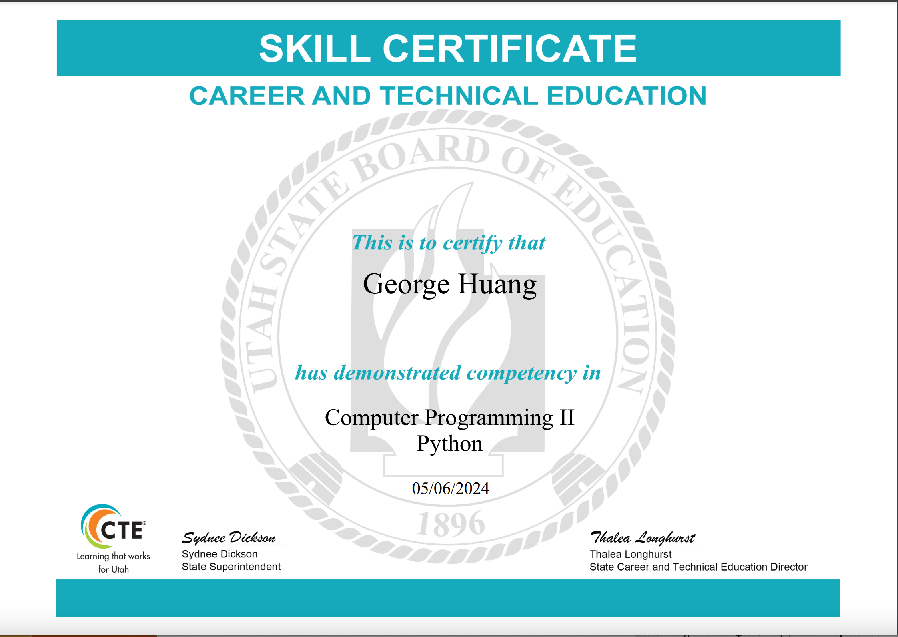
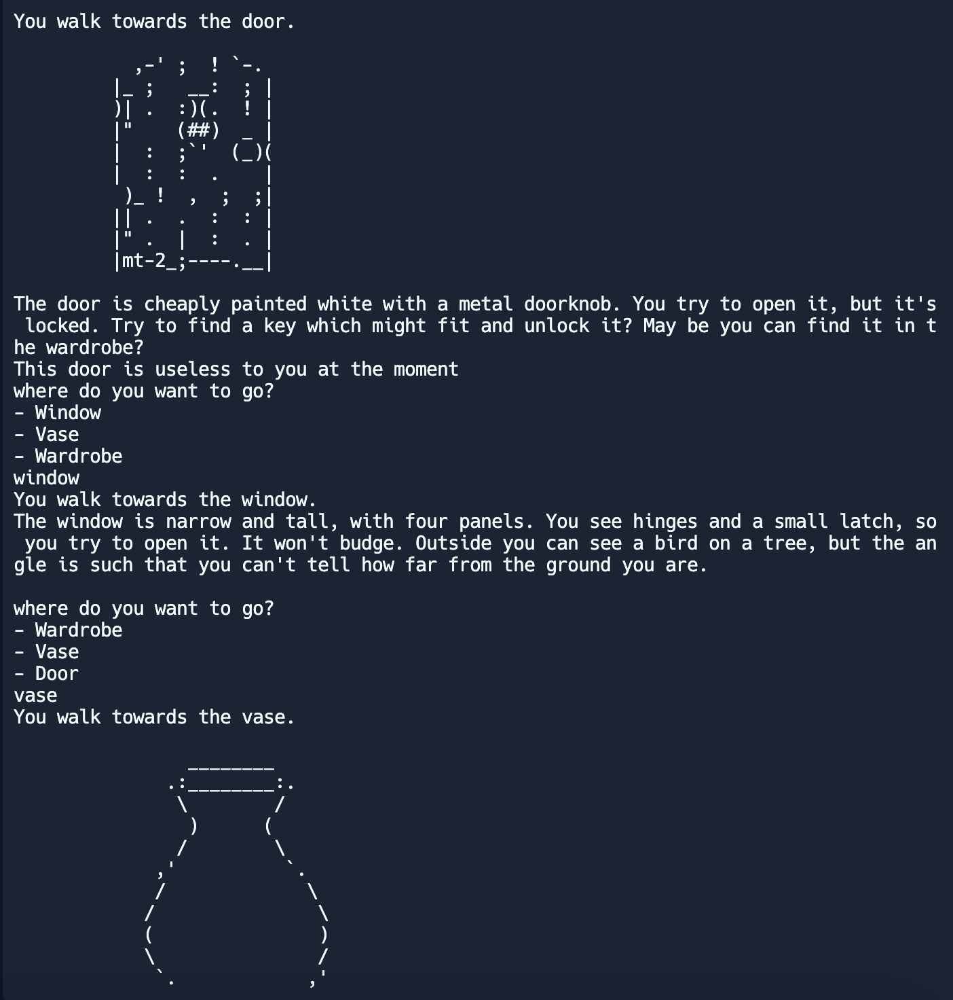
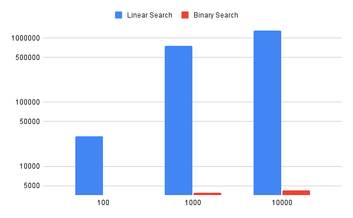
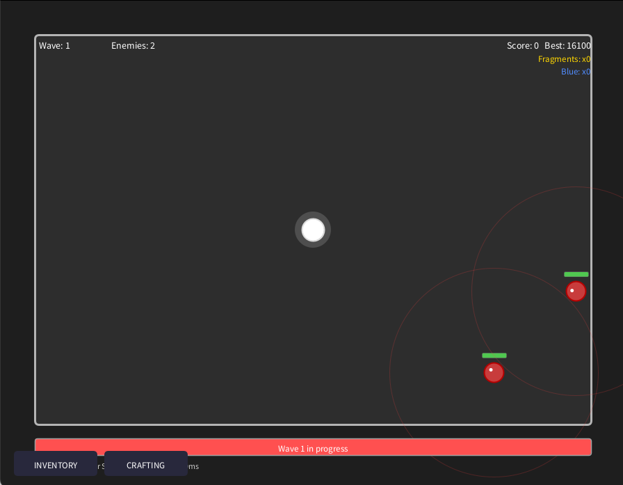
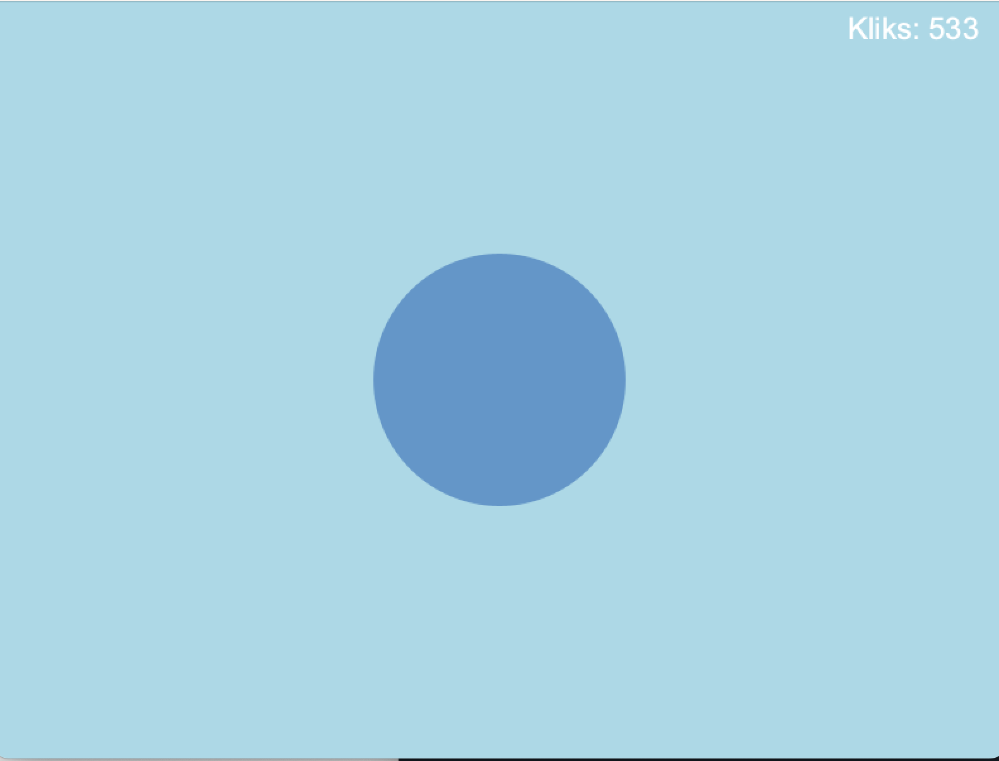
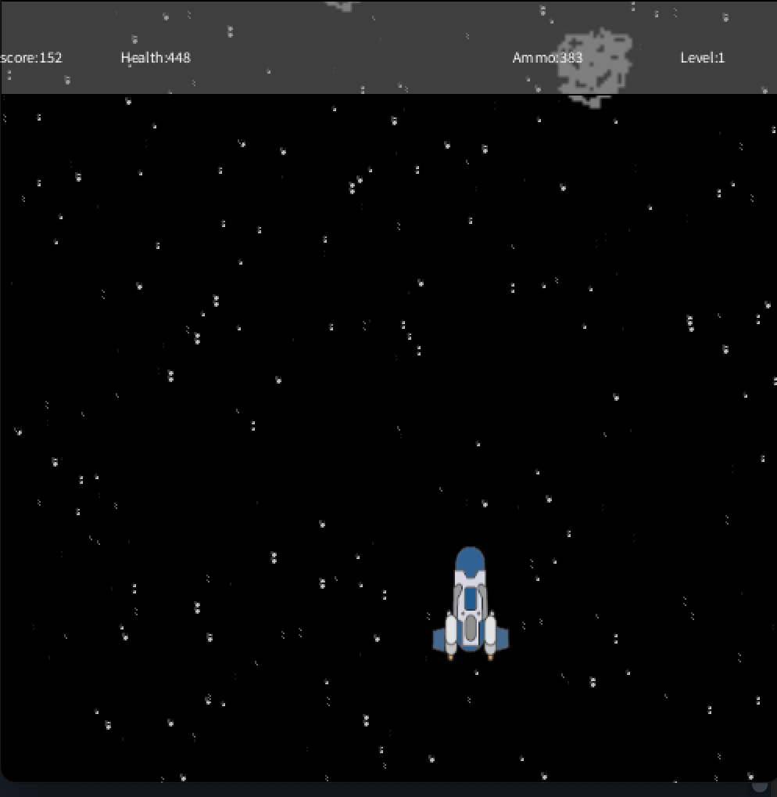
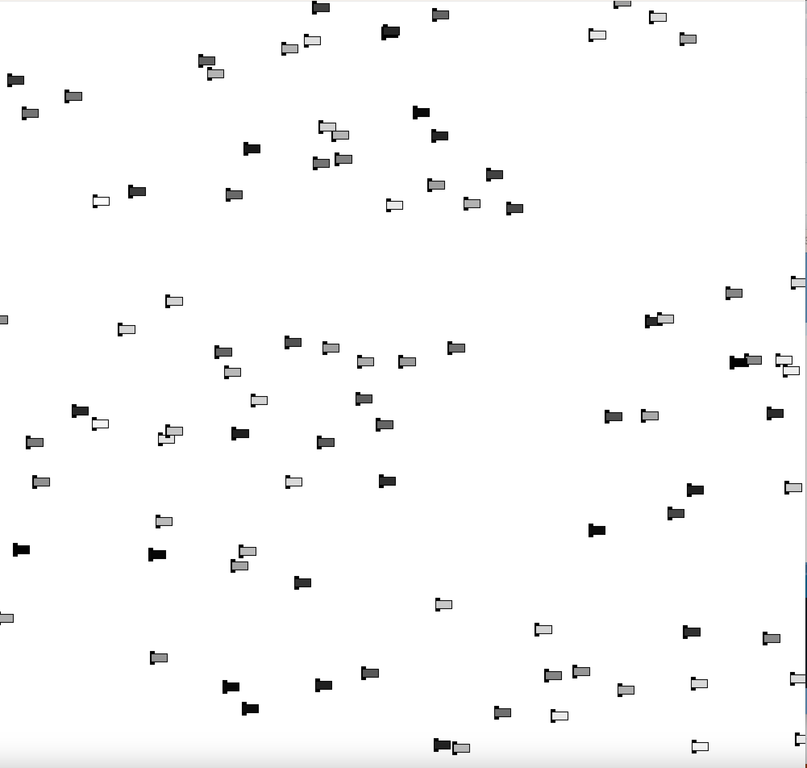
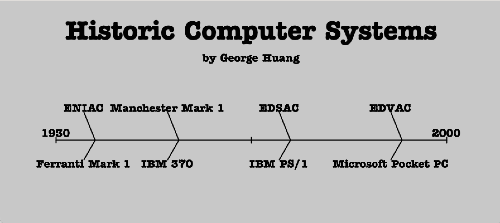
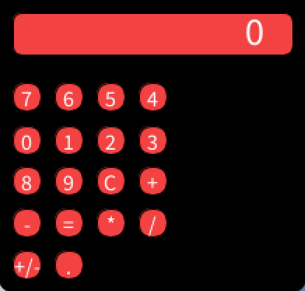
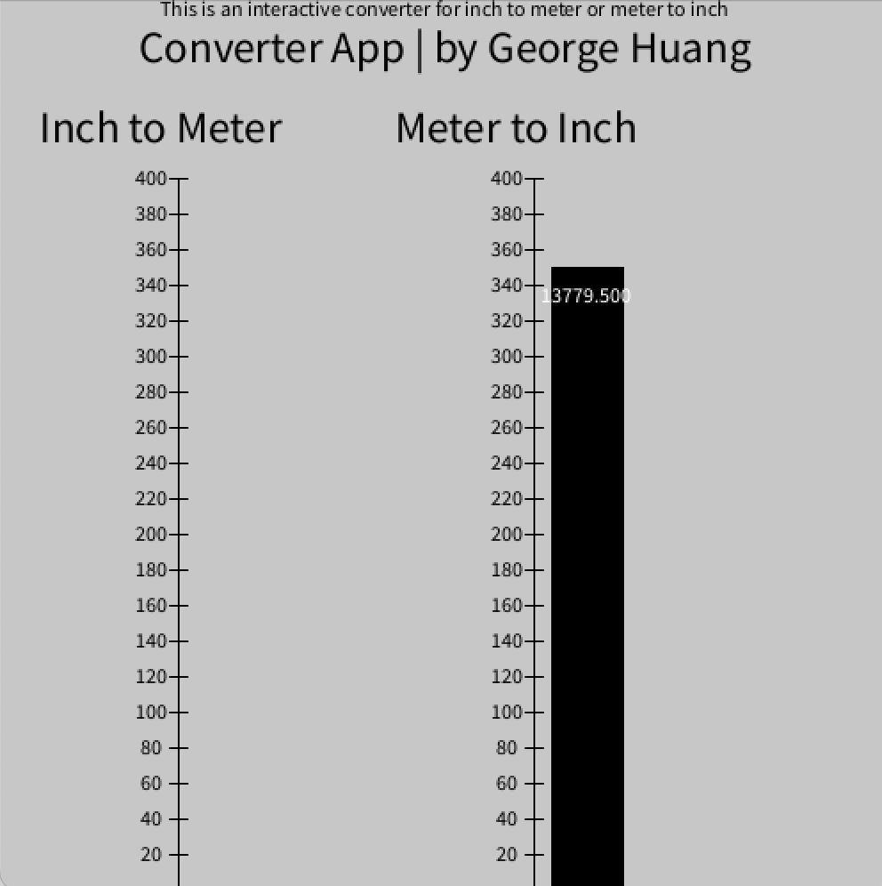

# George Huang's Programming Portfolio 2024-26
### Contact info: g89312@hotmail.com

### Game Development Portfolio (more certifications are listed there): https://github.com/S-erenity/gamedev1
## Tech Certifications

## Group Projects
### Empty Rooms:
Alone in a locked room, the user must investigate objects and answer existential questions to escape. The game includes a number of different challenging problems thats makes the user use problem-solving skills to try to escape. The game includes a number of different objects for the user to interact with creating a more immersive experience.
https://github.com/Rahul7834/Empty-Rooms


### School Record System:
An activity to practice the utlilization of sorting algorithms such as Linear, Binary, Insertion, etc.


Link: https://github.com/S-erenity/School-Record-System

### Weather App
Our group decided to create a weather app using mostly Python and some extensions that allow us to create GUI's and we are using the API from NOAA to get weather data based on your location.

Link: https://github.com/Sgandre3890/Beather


## Individual Projects

### Tape Nation:
Players control a character navigating a fixed arena, surviving escalating waves of AI enemies. The game is the foundational prototype for a larger RPG featuring tape-based crafting, gacha character collection, and open-world combat.

Features thus far: Implemented crafting UI and inventory. Added bosses and different loot types and swords.

Work in Progress: UML Document, UI Layout (some ui elements are blocking others on the screen), graphics, and gameplay polish.

Ran via Processing.


Link (inluding all year 2 concepts): https://github.com/S-erenity/TapeNation

### KLIX: 
Welcome to KLIX, the ultimate clicker game where every tap counts! In KLIX, your goal is simple: click the circle as many times as possible to rack up points and unlock powerful upgrades. The more clicks you unleash, the faster you progress through the game.

But be warned, the challenge doesn't end with clicking alone. Along the way, you'll encounter various upgrades that enhance your clicking power, allowing you to earn points even faster. As you continue to click your way through the game, you'll unlock badges that showcase your achievements and progress. Eventually, Your power will rival those of gods, allowing you to transend reality and gain control the klix universe. https://github.com/S-erenity/KLIX


Are you ready to embark on a clicking adventure like no other? Get your fingers ready and dive into the addictive world of KLIX!
### SpaceGame
OOP graphical game using sound and images for a full user experience



[Source Code](https://github.com/S-erenity/programmingportfolio/blob/main/src/SpaceGame.zip)

### Cars
A car simulator



[Source Code](https://github.com/S-erenity/programmingportfolio/blob/main/src/DriveCars.zip)

### Timeline
Interactive Timeline of Computers


[Source Code](https://github.com/S-erenity/programmingportfolio/blob/main/src/Timelinedone.zip)

### Calculator
A calculator simulator


[Source Code](https://github.com/S-erenity/programmingportfolio/blob/main/src/Calculator.zip)

### Conversion App
Converts Inches to Meters and Meters to Inch


[Source Code](https://github.com/S-erenity/programmingportfolio/blob/main/src/ConversionApp2.zip)

## CODE SAMPLES: 
### Classes and Objects: 
```
public class Animal {
    String name;
    int age;
    
    public Animal(String name, int age) {
        this.name = name;
        this.age = age;
    }
    
    public void makeSound() {
        System.out.println(name + " makes a sound");
    }
}

Animal dog = new Animal("Rex", 3);
dog.makeSound(); // Rex makes a sound
```
### Inheritance and Polymorphism:
```
public class Dog extends Animal {
    
    public Dog(String name, int age) {
        super(name, age);
    }
    
    @Override
    public void makeSound() {
        System.out.println(name + " says: Woof!");
    }
}

Dog myDog = new Dog("Rex", 3);
myDog.makeSound();
```
### Searching and Sorting:
```
int[] numbers = {5, 3, 8, 1, 9, 2};

for (int i = 0; i < numbers.length - 1; i++) {
    for (int j = 0; j < numbers.length - i - 1; j++) {
        if (numbers[j] > numbers[j+1]) {
            int temp = numbers[j];
            numbers[j] = numbers[j+1];
            numbers[j+1] = temp;
        }
    }
}
```


